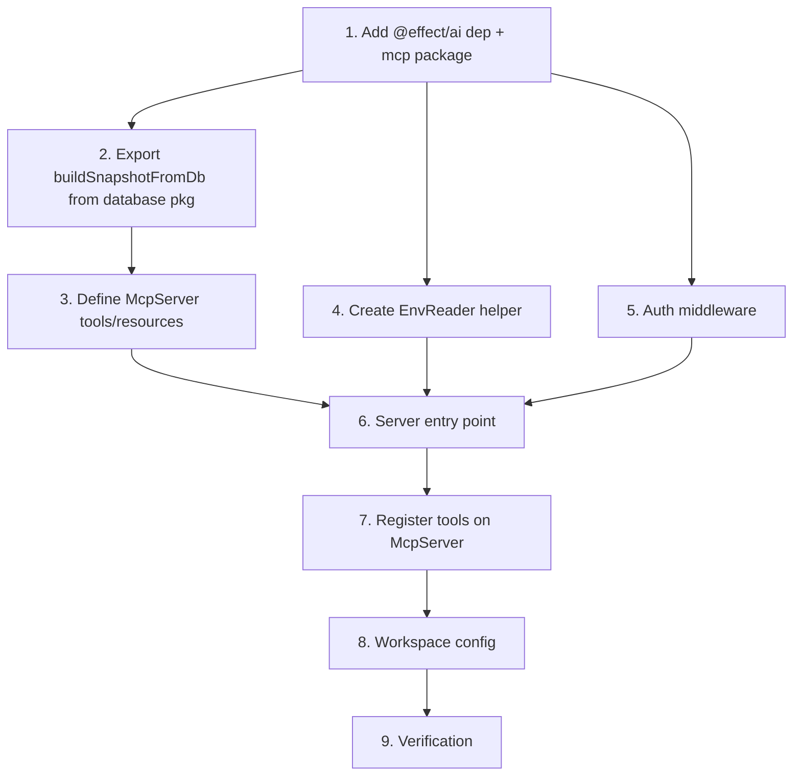

# Implementation Plan
  
## Goal
Expose  a read-only MCP server (HTTP/SSE) over the observed Effect Cluster, reusing the existing `WorkflowReader` and `OverviewReader` factories and the same `Schema.Struct` outputs that the Remix loaders use.

---

## ✅ Checkpoint (submit to Hugo before coding)

**Decision required on multi-env resolution strategy**

Scout findings:
- `DbManager` (in `@template/environments`) already caches `PgClient` pools per `envId`, resolved from the SQLite-backed `EnvironmentRepository`.
- The Remix UI stores `envId` in the session cookie; each loader calls `DbManager.getClient(envId)` → `makeWorkflowReader(pg)`.
- There is no concept of a global "default" Postgres URL at the MCP level — every connection goes through `DbManager`.

**Proposal (Option A — recommended):**  
`envId` is a required **tool parameter** (string). The MCP server uses `DbManager.getClient(envId)` to resolve the pool on every invocation.

| Option | Description | Pro | Con |
|--------|-------------|-----|-----|
| **A** envId as tool param | Single MCP server, user passes e.g. `envId: "prod"` | Zero infra, matches existing pattern, single port | Client must know envId |
| **B** server per env | Run N MCP instances, one per env | No param needed | N ports, N processes, operational burden, envs are dynamic |
| **C** resource URI path | `cluster://{envId}/overview` | Neat URIs | Tools can't encode envId in a path cleanly; all tools still need a param |

**Recommendation: A.**  DbManager was *designed* for this pattern (see the `getClient(envId)` cache).  
Submit this choice to Hugo before the worker starts writing code.

---

## Tasks

### 1. Add `@effect/ai` dependency to a new `packages/mcp/` package

- **File:** `packages/mcp/package.json` (new)
- **File:** `packages/mcp/tsconfig.json` (new, extends `tsconfig.base.json`)
- **File:** `packages/mcp/tsconfig.src.json` (new)
- **File:** `packages/mcp/tsconfig.build.json` (new)
- **Changes:** Create skeleton package with:
  - `dependencies`: `@effect/ai`, `@template/database` (workspace), `@template/domain` (workspace), `@template/environments` (workspace), `effect`, `@effect/platform`, `@effect/platform-node`
  - `scripts`: `build`, `dev`, `start`
  - `effect.generateExports` config matching other packages
- **Acceptance:** `pnpm install` succeeds, `tsc -b` compiles empty package.

### 2. Export `makeOverviewReader` (already exported) and ensure `buildSnapshotFromDb` is available from `@template/database`

The Remix web app currently has `buildSnapshotFromDb` in `web/app/types/overview.ts`. This is a pure transformation function (no SQL, no web imports). It must be reusable from the MCP package without depending on `@template/web`.

- **File:** `packages/database/src/repository/overviewReader/OverviewReader.ts`
- **Changes:**  
  Move the `buildSnapshotFromDb` function (and its dependent types `OverviewSnapshot`, `ClusterStats`, `WorkflowStats`, `ActivityPoint`, `NodeInfo`, `ShardInfo`, `NodeStatus`, `OverviewReaderResult`) into this file, or into a new `packages/database/src/repository/overviewReader/snapshot.ts`.  
  Update `packages/database/src/index.ts` to re-export it.
- **Acceptance:** `import { buildSnapshotFromDb } from "@template/database/overviewReader/OverviewReader"` compiles and produces the same shape as before.

### 3. Create the MCP server layer (`McpServer.ts`)

- **File:** `packages/mcp/src/McpServer.ts` (new)
- **Purpose:** Define all tools and resources using `@effect/ai`'s `McpServer` + `Toolkit`/`AiTool` pattern. No SQL here.

#### Resource: `cluster://overview`

| Field | Value |
|-------|-------|
| URI | `cluster://overview` |
| Input | `envId: string` (via resource URI query or separate; see multi-env decision) |
| Output shape | `OverviewSnapshot` (same shape as Remix `buildSnapshotFromDb` output) |
| Handler logic | `makeOverviewReader(pg).buildSnapshot()` → `buildSnapshotFromDb(raw)` |

#### Resource: `cluster://nodes`

| Field | Value |
|-------|-------|
| URI | `cluster://nodes` |
| Output shape | `ReadonlyArray<NodeInfo>` (extracted from `OverviewSnapshot.nodes`) |
| Handler logic | Same as overview, extract `.nodes` |

#### Resource: `cluster://shards`

| Field | Value |
|-------|-------|
| URI | `cluster://shards` |
| Output shape | `ReadonlyArray<ShardInfo>` |
| Handler logic | Same as overview, extract `.shards` |

#### Resource: `cluster://workflow-types`

| Field | Value |
|-------|-------|
| URI | `cluster://workflow-types` |
| Output shape | `ReadonlyArray<string>` (entity types / workflow names) |
| Handler logic | `makeOverviewReader(pg).buildSnapshot()` → `.entityTypes.map(e => e.entityType)` |

#### Tool: `list_executions`

| Field | Value |
|-------|-------|
| Name | `list_executions` |
| Input params | `envId: string`, `limit?: number` (default 50, max 200), `before?: string` (cursor), `status?: string[]`, `workflowName?: string`, `traceId?: string`, `from?: string` (ISO), `to?: string` (ISO) |
| Output shape | `{ items: RunSummary[], nextCursor: string | null }` — **reuses `RunSummary` Schema.Class exactly** |
| Handler logic | `makeWorkflowReader(pg).listRuns(filter, page)` |

#### Tool: `get_execution`

| Field | Value |
|-------|-------|
| Name | `get_execution` |
| Input params | `envId: string`, `executionId: string` (entity_id) OR `messageId: string` |
| Output shape | `RunDetail` — **reuses `RunDetail` Schema.Class exactly** |
| Handler logic | `makeWorkflowReader(pg).getRunByExecutionId(executionId)` or `getRun(messageId)` |

#### Tool: `get_execution_children`

| Field | Value |
|-------|-------|
| Name | `get_execution_children` |
| Input params | `envId: string`, `messageId: string` |
| Output shape | `RunSummary[]` — **reuses `RunSummary` exactly** |
| Handler logic | `makeWorkflowReader(pg).getRun(msgId)` → extract `traceId` → `getChildRuns(traceId, msgId)` |

#### Honesty rules enforced (same as UI):
- `RunStatus`: only the 7 literals (`pending`, `running`, `success`, `failed_app`, `crashed`, `interrupted`, `unknown`)
- `durationMs`: derived from Snowflake delta (`replyId - messageId`), null when no reply or non-positive
- `startedAt`: from real `last_read` column
- No "Compensating", no "degraded", no cpu/mem fields
- All status decoding uses the same `@template/domain/workflow/decode/status.ts` logic

### 4. Add `EnvReader` helper to resolve `PgClient` from `envId`

The MCP handlers need a consistent way to go from `envId: string` → `makeWorkflowReader(pg)`. Create a thin helper that encapsulates the DbManager lookup.

- **File:** `packages/mcp/src/EnvReader.ts` (new)
- **Changes:**
  ```
  export class EnvReader extends Effect.Service<EnvReader>()("EnvReader", {
    effect: Effect.gen(function*() {
      const db = yield* DbManager
      return {
        getReader: (envId: string) =>
          Effect.gen(function*() {
            const pg = yield* db.getClient(envId)
            return makeWorkflowReader(pg)
          }),
        getOverviewReader: (envId: string) =>
          Effect.gen(function*() {
            const pg = yield* db.getClient(envId)
            return makeOverviewReader(pg)
          })
      }
    }),
    dependencies: [DbManager.Default]
  }) {}
  ```
- **Acceptance:** `EnvReader` compiles, provides `getReader` and `getOverviewReader`.

### 5. Add auth middleware (API key)

Minimal protection: `MCP_API_KEY` env var (configurable). The SSE HTTP endpoint checks `Authorization: Bearer <key>` before upgrading to SSE. Return 401 if absent/mismatch.

- **File:** `packages/mcp/src/auth.ts` (new)
- **Acceptance:** Requests without the correct key get `401 Unauthorized` before any MCP handshake.

### 6. Create server entry point (`server.ts`)

- **File:** `packages/mcp/src/server.ts` (new)
- **Purpose:** Start the McpServer HTTP layer, apply auth middleware, listen on configurable port (default 3100).
- **Pattern:**
  ```typescript
  import { McpServer } from "@effect/ai/McpServer"
  import { Layer, ManagedRuntime } from "effect"
  // ...
  const McpLive = McpServer.layerHttp({ port: 3100 })
  const Runtime = ManagedRuntime.make(McpLive)
  Runtime.runPromise // …
  ```
- **Acceptance:** Running `tsx packages/mcp/src/server.ts` starts an HTTP server on port 3100. SSE endpoint at `/sse`.

### 7. Register tools and resources on the McpServer

- **File:** `packages/mcp/src/McpServer.ts`
- **Changes:** Wire each tool and resource definition (from Task 3) into the `McpServer` layer using `Toolkit` / `AiTool`.
- **Acceptance:** Each tool appears in the MCP `initialize` response's `tools` list. Each resource appears in `resources`. Calls return the correct data.

### 8. Update root workspace config

- **File:** `pnpm-workspace.yaml` — add `packages/mcp` to the workspace.
- **File:** `tsconfig.build.json` — add reference to `packages/mcp`.

### 9. Verification

Run the server, connect with `mcp-cli` or `claude mcp add`, test each tool and resource:
- `list_executions` with various filters returns `RunSummary[]` matching the UI
- `get_execution` returns `RunDetail` matching the UI
- `cluster://overview` returns the same snapshot shape as the overview page
- Auth: requests without `Authorization: Bearer <key>` are rejected
- No mutation tools exist in the listing

---

## Files to Modify

| File | Changes |
|------|---------|
| `pnpm-workspace.yaml` | Add `packages/mcp` |
| `tsconfig.build.json` | Add reference to `packages/mcp` |
| `packages/database/src/repository/overviewReader/OverviewReader.ts` | Move `buildSnapshotFromDb` + related types here (or add new `snapshot.ts`) |
| `packages/database/src/index.ts` | Re-export new snapshot builder |
| `packages/web/app/types/overview.ts` | Delete or re-import from `@template/database` (deprecate local copy) |
| `packages/web/app/actions/controller.tsx` | Update import of `buildSnapshotFromDb` to new location |

## New Files

| File | Purpose |
|------|---------|
| `packages/mcp/package.json` | Package manifest with `@effect/ai` + workspace deps |
| `packages/mcp/tsconfig.json` | Base TS config extending root |
| `packages/mcp/tsconfig.src.json` | Source TS config |
| `packages/mcp/tsconfig.build.json` | Build TS config |
| `packages/mcp/src/McpServer.ts` | Tool + resource definitions using `@effect/ai` |
| `packages/mcp/src/EnvReader.ts` | Helper to resolve `envId` → `PgClient` → reader |
| `packages/mcp/src/auth.ts` | API key middleware |
| `packages/mcp/src/server.ts` | Entry point — start McpServer layer with auth |
| `packages/mcp/src/index.ts` | Package re-exports |
| `packages/database/src/repository/overviewReader/snapshot.ts` (optional) | Extracted `buildSnapshotFromDb` if placed in separate file |

## Dependencies



Task 2 (snapshot export) blocks Task 3 (overview resource). Tasks 4-5 are independent and can be parallelized. Task 6 needs Tasks 3-5 complete.

## Risks

1. **`@effect/ai` API surface**: The exact API of `McpServer`, `Toolkit`, and `AiTool` may differ from assumptions. Need to read the actual package API before coding. If `@effect/ai` is not yet published at the right version, fallback to manual HTTP/SSE implementation using `@effect/platform` `HttpServer` + raw SSE.

2. **`buildSnapshotFromDb` dependency chain**: The function imports `OverviewReaderResult` from the database package and produces `OverviewSnapshot`. Ensure no circular deps. Moving to database package is cleanest.

3. **Resource URI envId resolution**: If the team picks Option A (envId as tool param), resources also need envId. MCP resources don't have built-in params — they can use URI query strings (e.g., `cluster://overview?envId=prod`) or the MCP `arguments` extension. This needs validation against the `@effect/ai` API.

4. **Auth**: API key is minimal but effective for self-hosted. If the MCP client (e.g., Claude Desktop) doesn't support Bearer auth on SSE, we may need a simpler token-in-URL approach (less secure but pragmatic). Document this decision.

5. **Performance**: `cluster://overview` resource runs all 10 SQL queries via `buildSnapshot()`. On large clusters this may be slow. No caching is added in this plan (keep it honest). If latency is a problem, a later plan can add a cache layer on the reader.

6. **Overview schema is a plain type, not a Schema.Struct**: The constraint says reuse Schema.Struct where available. `RunSummary` and `RunDetail` are Schema.Class. `OverviewSnapshot` is a plain TS type. For the MCP, format it as JSON with the same shape — this is consistent with the Remix loader (which serializes it as JSON too).
